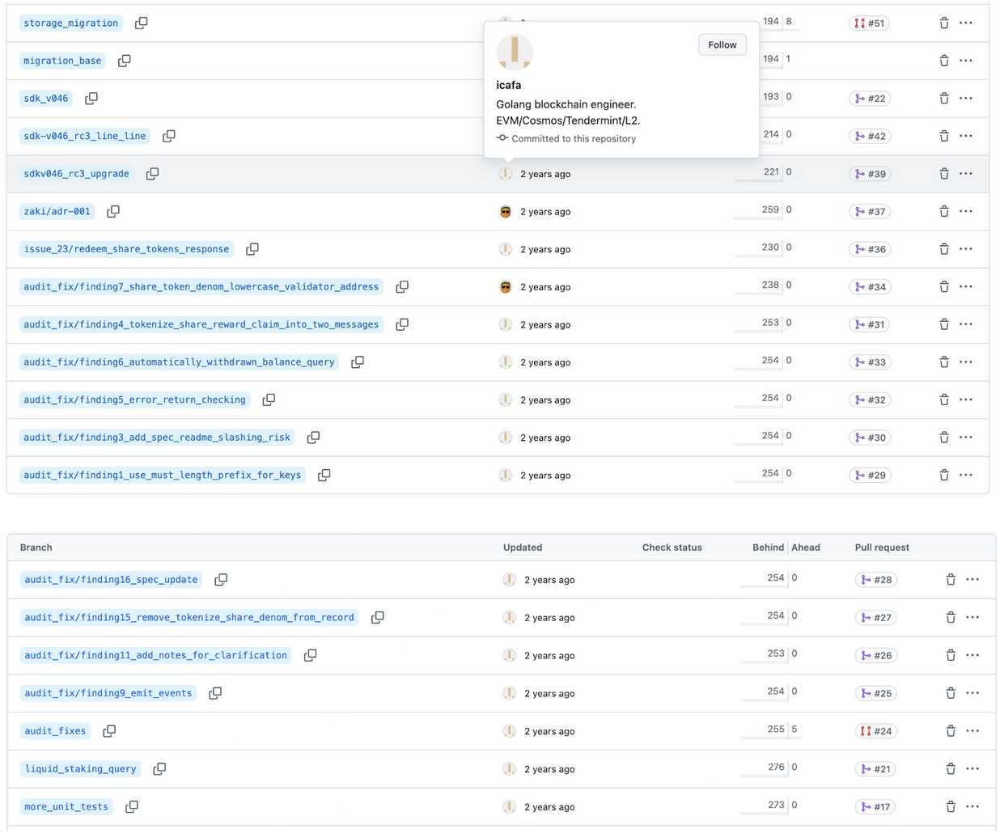
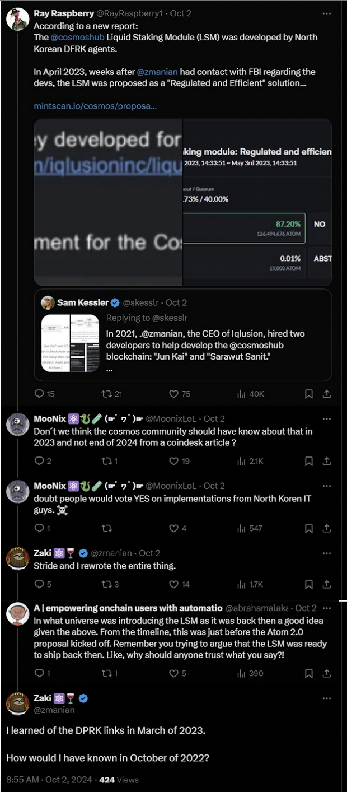
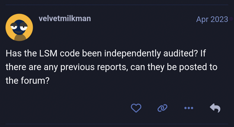
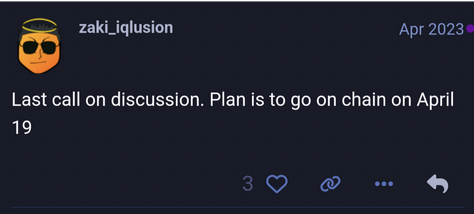

# On the LSM Module

**October 15, 2024**

Later edit October 24, 2024

Since the publication of this article, new information has surfaced providing additional context on the process that led to the addition of the LSM Module to the Cosmos Hub. 

According to Marko Baricevic, founder of Binary Builders – one of the Cosmos core teams funded by Interchain Foundation (ICF) as primary maintainers of the [Cosmos SDK](https://cosmos.network/appchains), and the team responsible for the [Interchain Builders Program](https://join.builders/) – his team opposed the inclusion of the LSM on the Hub: “The SDK team rejected the design of the LSM. When we reviewed it we said we won’t upstream this due to lack coordination of design and we see the design as subpar.”

Further details revealed that while the Binary Builders team reviewed the code, they strongly advised against pushing it into production. Baricevic explained “[we] reviewed the code but gave feedback that we wouldn’t push this code into prod[uction]..."the staking module and distribution are fragile as is and this worried us a lot how it was being hacked into those modules”. Due to these concerns, which were shared with the teams involved in the LSM design and adoption for the Hub, the Binary Builders team decided to push the LSM to a separate branch of the SDK. Baricevic added, “There is a branch in the SDK the (Cosmos) Hub team maintains but it is outside our scope of work and we do not review or approve PRS because we don’t believe it’s a good design.”

Given this newly surfaced information, which shows clear prior disagreement from the core team maintaining the Cosmos SDK, we believe it is important to bring this to the attention of the Cosmos community. As a result, we will be removing Binary Builders from the article as a party willingly contributing to the LSM module’s inclusion on the Hub”

---

As many in the Cosmos community are now aware, it was revealed that a
significant portion of the Liquidity Staking Module (LSM), created by Iqlusion
for the Cosmos Hub, was developed by North Korean agents.  The development of
the LSM began in 2021, initiated by the Interchain Foundation (ICF) and led by
Iqlusion and Zaki Manian. As the project progressed, it became a principal
collaboration between Iqlusion and Stride Labs, with further contributions from Informal Systems to integrate it into Gaia.

Below, All in Bits (AiB) provides a detailed assessment of the LSM’s
development journey—from the first commits to its final implementation on the
Cosmos Hub—highlighting concerns about the integrity and security of the LSM.
We also examine the actions and omissions of Zaki Manian during the development
and promotion of the LSM, which raise serious concerns about the transparency
and safety of the Cosmos Hub.

It is important to note that the LSM is not a standalone module but rather a
series of modifications and extensions built on top of the existing Cosmos
staking modules. The term “module” is more of a conceptual shorthand, used to
describe the liquid staking features added to the core Cosmos SDK staking
functionality. Consequently, any vulnerability in Iqlusion’s LSM that impacts
these core modules could potentially put all staked ATOM at risk, as liquid
staking interacts directly with staked assets.

**Timeline of Events:**

1. **June 24, 2021:** The Interchain Foundation (ICF) reported that Iqlusion
   had secured a core funding agreement to support ongoing work on “Gaia,
   network upgrades, the distribution module, and staking derivatives.”
   *\[Appx. 1\].*  
2. **August 2021:** Zaki Manian and Iqlusion began development of the LSM, with
   Jun Kai and Sarawut Sanit, later linked to North Korea, contributing a
   majority of the code. *\[Appx. 2\].*  
3. **July 2022:** Oak Security conducted an audit (performed against [this
   commit](https://github.com/iqlusioninc/liquidity-staking-module/commit/faf413d4624af0a6fa8aac2c359d1b1b4f6adbc9)
   dated Feb 11, 2022), that identified critical vulnerabilities in the LSM,
   particularly related to slashing evasion. Alarmingly, the same North Korean
   developers who had contributed the majority of the original code were tasked
   with addressing the findings raised by the audit. This not only undermined
   the integrity of the remediation process but also gave the potential
   creators of the vulnerabilities the opportunity to either fix or obscure any
   intentional weakness they may have introduced, potentially exposing the
   system to further risks. *\[Appx. 3\].*  
4. **December 4, 2022:** The last code merge was made by North Korean
   developers. *\[Appx. 4\].*  
5. **March 2023:** Zaki was contacted by the FBI, which revealed the
   involvement of North Korea linked developers. He did not disclose this
   information to the Cosmos community. *\[Appxs. 5, 10\].*  
6. **April 3, 2023:** Stride Labs, led by developer @sampocs, began working on
   the LSM, primarily adding security features and modifying the exempt-factor
   to validator-bond-factor. Though described as a “rewrite,” their work mostly
   involved porting the original code for SDK compatibility, with minimal
   refactoring of the North Korean developers’ contributions. *\[Appx. 11\].*  
7. **April 7, 2023:** Zaki initiated discussion for a Signaling Proposal on the
   Cosmos Hub Forum, related to integrating the LSM onto the Cosmos Hub.
   *\[Appx. 6\].*  
8. **April 7, 2023:** Zaki posted in the Cosmos Hub Forum and on Twitter that
   the LSM was “finished,” despite knowing of unresolved security issues and
   minimal code rewrites of the North Korean developers. The ICF, Iqlusion,
   Stride Labs and Informal Systems all posted in support of the LSM. *\[Appxs.
   7, 8\].*  
9. **April 19, 2023:** Signaling Proposal \#790 was submitted on-chain to
   integrate the LSM onto the Cosmos Hub without further audits or transparency
   about the North Korean developers. The proposed code had undergone
   modifications since the initial findings from Oak Security, yet it had
   remained unaudited for over 14 months (calculated from February 11, 2022
   commit used for the audit). *\[Appx. 9\].*  
10. **August 25, 2023:** Software upgrade Proposal \#821 was submitted
    on-chain to integrate the LSM onto the Cosmos Hub. *\[Appx. 12\].*  
11. **September 11, 2023:** Informal Systems integrated the
    LSM module to the Hub in collaboration with Iqlusion and Stride. By the
    time of this integration, it had been 19 months since the last audit (audit
    was performed against a
    [commit](https://github.com/iqlusioninc/liquidity-staking-module/commit/faf413d4624af0a6fa8aac2c359d1b1b4f6adbc9)
    dated February 11, 2022) during which the module underwent changes and
    apparently fixes for vulnerabilities.  *\[Appx. 13\].*  
12. **October 2, 2024:** Zaki admitted in a tweet that he had learned of the
    DPRK links in March 2023 but had failed to disclose this information to the
    Cosmos community before pushing the LSM signaling proposal in April 2023\.
    *\[Appx. 10\].*

**Key Findings:**

**1\. Insecure Design of the LSM**

The Liquid Staking Module (LSM) was designed with a fundamental flaw that
allowed future slashing penalties to be avoided, thereby shifting the risk onto
other stakers. This flaw undermines the core principles of proof-of-stake
systems. The Oak Security audit highlighted these vulnerabilities, particularly
the ability for stakers to evade slashing by tokenizing their delegations.
Despite these clear warnings, Iqlusion and Zaki Manian acknowledged the flaw
but allowed it to persist under the guise of an “intentional design goal.”

It is highly implausible that such a design could be considered an
“intentional” goal, as it contradicts the fundamental principles of staking
security. Allowing slashing evasion introduces systemic risk, offloading
penalties to other honest stakers and weakening the entire network’s integrity.
No responsible developer, especially one with experience in proof-of-stake
systems, could reasonably view this as a secure or desirable feature. The
decision to frame this as a deliberate design choice reflects a serious lapse
in judgment and raises further questions about the transparency and motivations
behind the promotion of the LSM.

Zaki and Iqlusion promoted the LSM as ‘complete’ while this critical
vulnerability remained unresolved, jeopardizing the security of the Cosmos
community. By presenting the design flaw as intentional, they misled the
community about the real risks associated with the module, creating a false
sense of security while failing to address the vulnerabilities that could
destabilize the network.

**2\. North Korean Developers, Lack of Transparency**

Our findings confirm that a majority of the LSM code, including critical
portions, was written by two developers with confirmed links to North Korea:
Jun Kai and Sarawut Sanit. In an October 2, 2024 tweet, Zaki Manian admitted
that he became aware of their DPRK links as early as March 2023, following
contact by the FBI. 

Despite possessing this crucial information, Zaki failed to conduct any further
audits or a thorough review of the North Korean developers’ contributions
before promoting the LSM for integration with the Cosmos Hub. Rather than
taking proactive measures, such as conducting an additional audit or disclosing
this issue to the Cosmos community, Zaki publicly asserted that the module was
“ready to be deployed”.

Upon learning that his two main contributors to the LSM were directly linked to
North Korea, Zaki should have immediately acted to address these concerns.
Instead, he disregarded the serious vulnerabilities he knew about, acting
unreasonably. On April 7, 2023, Zaki initiated a thread on the Cosmos Hub
Forum, proposing a signaling proposal for the LSM and claiming the module was
“finished”. This occurred just after a developer from Stride Labs submitted
their first, minimal pull request related to the LSM. Less than two weeks
later, on April 19, 2023, Zaki advanced Signaling Proposal \#790 for a vote on
the Cosmos Hub. 

For sixteen months (spanning both the pre-audit phase from August 2021 to July
2022 and post audit phase from July 2022 to December 2022), the LSM was
developed by individuals linked to North Korea, and their contributions were
integrated into the Cosmos Hub without proper security vetting. Even more
concerning, the vulnerabilities identified in the July 2022 Oak Security audit
were assigned to be fixed by the same North Korean developers. Zaki’s decision
to move forward with Signaling Proposal \#790 in April 2023, using a version of
the code that, while it had undergone changes, still largely consisted of code
written by North Korean developers and had not been audited since July
2022–leaving 14 months of unaudited code (calculated from the February 11, 2022
commit), including 5 months of new contributions from the North Korean
developers–despite being aware of these critical issues, constitutes gross
negligence. 

The Cosmos community was kept uninformed of crucial information that would
likely have changed the outcome of Proposal \#790, and the module was
misleadingly promoted as “finished” in the face of significant security
concerns. Furthermore, Zaki’s failure to report these issues to the Hub’s
implementation team, while allowing the Software Upgrade Proposal \#821 to
proceed with incorporating the LSM module into the Hub, exposed the entire Hub
community to even greater risk. 

**3\. Material Misrepresentation and Gross Negligence**

In March 2023, Zaki Manian became aware of Kai and Sanit’s links to North Korea
and that they were under investigation by the FBI. However, he failed to
disclose this critical information to the Cosmos community. Instead, he and
Iqlusion continued promoting the LSM, placing the network and its users at
significant risk. In April 2023, the LSM was further promoted by the ICF via
its social media channels (e.g. @cosmoshub), along with support from Stride
Labs and Informal Systems. 

Zaki’s lack of transparency and poor judgment represent a profound breach of
the trust placed in Iqlusion by the Cosmos community. His statements during the
signaling pre-proposal period, and while the proposal was live on-chain were
misleading. By strongly implying both the urgency and readiness of the LSM,
while omitting crucial details about its security issues and the involvement of
North Korean developers, Zaki Manian materially misrepresented the development
and status of the LSM to the Cosmos community. 

Moreover, Zaki’s claim that the LSM underwent a “rewrite” after the FBI
revealed the developers’ North Korean links is contradicted by an analysis of
the GitHub commits, which shows only minimal changes. The core of the module,
written by the North Korean developers, remains largely intact. Zaki’s
negligence in addressing security risks was further compounded by his continued
promotion of the module alongside the principal parties involved in pushing the
LSM for adoption – ICF, Iqlusion, Stride Labs and Informal Systems –
culminating in the LSM being added on the Hub following Software Proposal \#821
in August 2023, despite being fully aware of the risks involved. The
discrepancy between Zaki’s public assurances and the actual state of the module
calls into question the integrity of the information he provided to the Cosmos
community during this critical decision-making period. 

The sequence of events also raises concerns about the obvious lack of
transparent reporting by ICF grantees and the insufficient oversight exercised
by the ICF regarding the LSM’s development. The governance processes that
ratified and implemented the module lacked the necessary checks and balances to
properly vet the code before it was deployed on the Hub.

**Demand for Accountability and Security in Cosmos:**

We urge the Cosmos governance community to take immediate action by conducting
a comprehensive audit of the LSM and providing a full disclosure of the
timeline of events involving the North Korean linked developers. We also call
on the Interchain Foundation to take the following actions: 

1. Create a blacklist of individuals and entities involved in promoting
   insecure protocols, starting with Zaki Manian and Iqlusion;  
2. Establish audit requirements for any code development subsidized by the ICF;  
3. Develop an oversight protocol to ensure thorough safety and security
   assessments of code before contributors submit signaling proposals aimed at
   adding new implementations to the Cosmos Hub. 

It is crucial for the future security of the Cosmos ecosystem that those
responsible for this breach of trust are held accountable. The community
deserves a transparent, secure network where risks are addressed openly and
governance decisions are made with full knowledge of potential threats.

**AtomOne’s Commitment to Security and Transparency:**

AtomOne project was founded by its community on principles of security,
transparency, and community governance. Unlike the Cosmos Hub, the AtomOne
Community, through its founding Constitution, has banned liquid staking to
eliminate the risk of slashing evasion and prioritize community protection.
AtomOne is committed to building a secure and community-governed ecosystem, and
we believe Cosmos must take similar actions. By committing to openness and
accountability, Cosmos can follow AtomOne’s lead in safeguarding its future and
maintaining the trust of its community. 

**Contact Information:**

For media inquiries or further information, or if you have relevant information
related to these events, or for any corrections, please contact us at
[**legal@allinbits.com**](mailto:legal@allinbits.com) with the subject line:
**“LSMNK”**.  

**Appendix: Source References for LSM Security Concerns and Timeline**

**1\. Interchain Foundation (ICF) Announces Core Funding Agreement for Iqlusion**

**Sources**: [2021 Q1 Interchain Foundation Assets and Funding Overview](https://medium.com/the-interchain-foundation/2021-q1-interchain-foundation-assets-and-funding-overview-ab0f15ffc574); [ICF Q1–2021 Funding Recipients. Our first quarter of funding proposals… | by Interchain | The Interchain Foundation | Medium](https://medium.com/the-interchain-foundation/icf-q1-2021-funding-recipients-7028f709ffc)  

**2\. GitHub Commits Showing Contributions by North Korean Developers**

| “Jun Kai” (multiple github handles/emails as per git log) [icafa](https://github.com/icafa) Junkai121 (Gitlab) | “Sarawut Sanit” (multiple github handles/emails as per git log) devstar [0xskydb](https://github.com/0xskydb) 0xkobe 0xdbkey [ssdbkey](https://github.com/ssdbkey) |
| :---- | :---- |

**Source:** [GitHub \- Iqlusion LSM Repo](https://github.com/iqlusioninc/liquidity-staking-module)

**3\. Oak Security Audit (July 2022\) and North Korean Developers Audit Contributions**

**Source:** [Oak Security Audit Report (public link)](https://github.com/oak-security/audit-reports/blob/main/Interchain%20Foundation/2022-07-20%20Audit%20Report%20-%20Liquidity%20Staking%20Cosmos%20SDK%20Modules%20v1.0.pdf)

**Source:** [liquidity-staking-module repository on GitHub (public link)](https://github.com/iqlusioninc/liquidity-staking-module/branches/all)

**4\. Last Code Merge from North Korean Developers**

**Source:** [GitHub- Jun Kai Code Merge](https://github.com/iqlusioninc/liquidity-staking-module/pull/50)   

**5\. Zaki Manian Admitting to Having Knowledge of DPRK Links in March 2023 and Claiming to Have Rewritten the LSM**

**Source:** Response to [Twitter post](https://x.com/RayRaspberry1/status/1841458127692247083) by Zaki Manian on October 2, 2024, where he admitted to have learned of the DPRK involvement in March 2023\.

**6\. Zaki Manian Posts April 7, 2023 Signaling Proposal on the Cosmos Hub Forum to add the LSM to the Cosmos Hub**  

**Source:**  [Cosmos Hub Forum Proposal](https://forum.cosmos.network/t/signaling-proposal-draft-add-liquid-staking-module-to-the-cosmos-hub/10368)

**7\. April 7, 2023 Cosmos Forum Post by Zaki on LSM Being “Finished” despite unresolved vulnerabilities.**  

**Source:** [Cosmos Hub Forum Post](https://forum.cosmos.network/t/signaling-proposal-draft-add-liquid-staking-module-to-the-cosmos-hub/10368/7)  

**Source:** [Cosmos Hub Forum Post](https://forum.cosmos.network/t/signaling-proposal-draft-add-liquid-staking-module-to-the-cosmos-hub/10368/13)  

**Source**: [Cosmos Hub Forum Post](https://forum.cosmos.network/t/signaling-proposal-draft-add-liquid-staking-module-to-the-cosmos-hub/10368/40)

**Source**: [Cosmos Hub Forum Post](https://forum.cosmos.network/t/signaling-proposal-draft-add-liquid-staking-module-to-the-cosmos-hub/10368/45)  

**8\. April 7, 2023 Zaki Manian posts on X (formerly Twitter) that LSM is up for discussion on the Cosmos Forum. The ICF via @CosmosHub, Stride and Informal Systems cross promote the LSM.**  

**Source**: [Manian April 7, 2023 X Post](https://x.com/zmanian/status/1644359470393221120?t=4ZIW_0budX8oAPXcC398zg&s=19)

**Source**: [Cosmos Hub Tweet](https://x.com/cosmoshub/status/1649402715020165120?t=TWoxqxnbr26wTHePU6T2Sg&s=19) *(owned and managed exclusively by the ICF at the time of the tweet)*

**Source**: [Cosmos Hub Tweet](https://x.com/cosmoshub/status/1651230608884998145?t=ZNWDwQKlCHFEjOgxi6qrIg&s=19)  

**Source**: [Stride Labs Tweet](https://x.com/stride_zone/status/1648052077967409152?t=G2CPwKV2mR7dXs74KAfQfA&s=19)  

**Source**: [Informal Systems Tweet](https://x.com/informalinc/status/1650502386937475074?t=FFqrDzkJ-ZLK2V3_BDXY1A&s=19)

**9\. Cosmos Hub Proposal \#790 (Liquid Staking Module) Passes**

**Source:** [Cosmos Hub Governance Proposal \#790](https://www.mintscan.io/cosmos/proposals/790)

**10\. March 2023- FBI disclose to Zaki Manian that Kai and Sunit are linked to North Korea**  

**Source:** CoinDesk Article [How North Korea Infiltrated the Crypto Industry](https://www.coindesk.com/tech/2024/10/02/how-north-korea-infiltrated-the-crypto-industry/)

**11\. Stride Labs First Contribution**

**Source:** [GitHub](https://github.com/iqlusioninc/liquidity-staking-module/pull/59) showing the first contribution made by Stride Labs starting in April 2023

**12\.  Software upgrade Proposal \#821 was submitted on-chain to integrate the LSM onto the Cosmos Hub.**  

**Source:** [Gaia v12 Upgrade Proposal with LSM \#821](https://www.mintscan.io/cosmos/proposals/821)  

**13\.  Informal Systems integrate the LSM module to the Hub in collaboration with Iqlusion and Stride**   
“The integration to Gaia required moving the Hub on a special branch of the SDK (i.e., v0.45.16-ics-lsm). Note that the Hub has been using a special branch of SDK since the ICS release in the v9 upgrade. Having LSM on a special branch of SDK means though that LSM is not being automatically upgraded with mainline SDK. Thus, LSM requires continuous maintenance until it gets added to mainline SDK. For this reason, we upgraded LSM to SDK v0.47. Currently, the upgrade is in review and we are working on Gaia integration.” 

**Source**: [Interchain Foundation, “Cosmos Hub Engineering Update](https://medium.com/the-interchain-foundation/cosmos-hub-engineering-update-august-2023-8ffa75a5b3cb)” [The Informal Blog \- Cosmos Hub Update: Q4 2023](https://informal.systems/blog/cosmos-hub-update-q4-2023) 

**Source**: [Informal Systems Tweet](https://x.com/informalinc/status/1694092154434638299?t=tTjLmGR2JArvrS85Yq8pmQ&s=19)	        	       

**Source**: [Stride Labs Tweet](https://x.com/interchainriley/status/1701213307988856989?t=w3mhumKoZP25ddbKd2T8ow&s=19)

**Source**: [Cosmos Hub Tweet](https://x.com/cosmoshub/status/1701951434651013482?t=4aimYRZ8eK4KIk26-NHqQA&s=19)

**Source**: [Informal Systems Tweet](https://x.com/informalinc/status/1699527965867225113?t=sxyovaGTI7mhZC6lzPBpBQ&s=19)  

**Recording** **link**: [Informal Systems Spaces Recording](https://x.com/i/spaces/1dRJZMarBRmGB)

